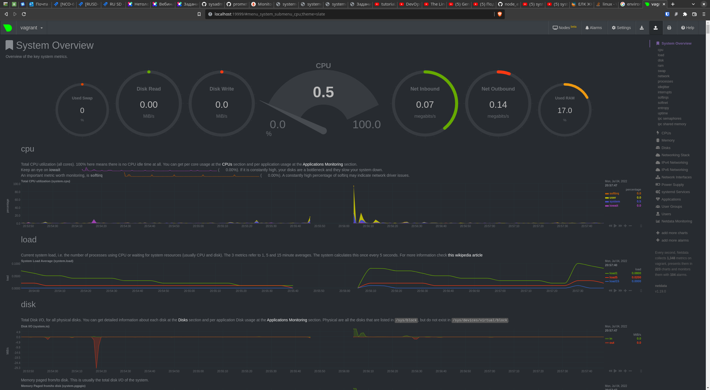

# Домашнее задание к занятию "3.4. Операционные системы, лекция 2"  

1. По руководству скачиваем и распаковываем **node exporter**. Переместим его в директорию /usr/bin/node_exporter  
   ```bash
   wget https://github.com/prometheus/node_exporter/releases/download/v1.3.1/node_exporter-1.3.1.linux-amd64.tar.gz
   tar xvfz node_exporter-1.3.1.linux-amd64.tar.gz
   sudo mv node_exporter-1.3.1.linux-amd64 /usr/bin/node_exporter
   ```
   
   Создаем UNIT-файл `sudo nano /etc/systemd/system/node_exporter.service` со следующим содержимым:  

   ```
   [Unit]
   Description=Node Exporter service
   
   [Service]
   EnvironmentFile=/opt/node_exporter/node_exporter
   ExecStart=/usr/bin/node_exporter/node_exporter $MY_OPTS
   
   [Install]
   WantedBy=default.target
   ```
   
   В UNIT-файле предусмотрена возможность добавления опций к запускаемому процессу через внешний файл */opt/node_exporter/node_exporter*, в котором прописана переменная **MY_OPTS**. К примеру `MY_OPTS="--collector.ntp"`.  

   После добавления UNIT-файла наш сервис уже был с статусе "loaded", но best-practice говорит, что стоит выполнить `systemctl daemon-reload`.  
   Помещаем сервис в автозагрузку `systemctl enable node_exporter` и перезагружаем виртуальную машину. Далее выполняем `systemctl status node_exporter` и видим следующее:  

   ```
   ● node_exporter.service - Node Exporter service
        Loaded: loaded (/etc/systemd/system/node_exporter.service; enabled; vendor preset: enabled)
        Active: active (running) since Mon 2022-07-04 17:46:44 UTC; 11s ago
      Main PID: 629 (node_exporter)
         Tasks: 4 (limit: 1066)
        Memory: 13.9M
        CGroup: /system.slice/node_exporter.service
                └─629 /usr/bin/node_exporter/node_exporter --collector.ntp

   Jul 04 17:46:44 vagrant node_exporter[629]: ts=2022-07-04T17:46:44.570Z caller=node_exporter.go:115 level=info collector=thermal_zone
   Jul 04 17:46:44 vagrant node_exporter[629]: ts=2022-07-04T17:46:44.570Z caller=node_exporter.go:115 level=info collector=time
   Jul 04 17:46:44 vagrant node_exporter[629]: ts=2022-07-04T17:46:44.570Z caller=node_exporter.go:115 level=info collector=timex
   Jul 04 17:46:44 vagrant node_exporter[629]: ts=2022-07-04T17:46:44.570Z caller=node_exporter.go:115 level=info collector=udp_queues
   Jul 04 17:46:44 vagrant node_exporter[629]: ts=2022-07-04T17:46:44.570Z caller=node_exporter.go:115 level=info collector=uname
   Jul 04 17:46:44 vagrant node_exporter[629]: ts=2022-07-04T17:46:44.570Z caller=node_exporter.go:115 level=info collector=vmstat
   Jul 04 17:46:44 vagrant node_exporter[629]: ts=2022-07-04T17:46:44.570Z caller=node_exporter.go:115 level=info collector=xfs
   Jul 04 17:46:44 vagrant node_exporter[629]: ts=2022-07-04T17:46:44.570Z caller=node_exporter.go:115 level=info collector=zfs
   Jul 04 17:46:44 vagrant node_exporter[629]: ts=2022-07-04T17:46:44.571Z caller=node_exporter.go:199 level=info msg="Listening on" address=:>
   Jul 04 17:46:44 vagrant node_exporter[629]: ts=2022-07-04T17:46:44.571Z caller=tls_config.go:195 level=info msg="TLS is disabled." http2=fa>

   ```

   Сервис *loaded* и *enabled*, находится в статусе *Active (running)*. Проверяем как отрабатывается `systemctl stop node_exporter` и снова смотрим статус. В конце вывода статуса видим успешную остановку сервиса:  
   ```
    Jul 04 17:49:10 vagrant systemd[1]: Stopping Node Exporter service...
    Jul 04 17:49:10 vagrant systemd[1]: node_exporter.service: Succeeded.
    Jul 04 17:49:10 vagrant systemd[1]: Stopped Node Exporter service.
   ```
   Повторный запуск `systemctl start node_exporter` так же отрабатывает корректно.  
2. `curl -s localhost:9100/metrics | grep cpu`  
   node_cpu_seconds_total{cpu="0",mode="idle"} 20894.44
   node_cpu_seconds_total{cpu="0",mode="iowait"} 7
   node_cpu_seconds_total{cpu="0",mode="irq"} 0
   node_cpu_seconds_total{cpu="0",mode="nice"} 0
   node_cpu_seconds_total{cpu="0",mode="softirq"} 0.95
   node_cpu_seconds_total{cpu="0",mode="steal"} 0
   node_cpu_seconds_total{cpu="0",mode="system"} 110.98
   node_cpu_seconds_total{cpu="0",mode="user"} 48.82
   process_cpu_seconds_total 0.06


   `curl -s localhost:9100/metrics | grep memory`
   node_memory_MemAvailable_bytes 6.29215232e+08
   node_memory_MemFree_bytes 6.38066688e+08
   
   `curl -s localhost:9100/metrics | grep disk`
   node_disk_io_now{device="sda"} 0
   node_disk_io_time_seconds_total{device="sda"} 51.160000000000004
   node_disk_read_bytes_total{device="sda"} 7.36811008e+08
   node_disk_read_time_seconds_total{device="sda"} 25.027
   node_disk_write_time_seconds_total{device="sda"} 29.655
   node_disk_written_bytes_total{device="sda"} 6.8165632e+08

   `curl -s localhost:9100/metrics | grep network`
   node_network_receive_bytes_total{device="eth0"} 3.3111178e+07
   node_network_receive_drop_total{device="eth0"} 0
   node_network_receive_errs_total{device="eth0"} 0
   node_network_transmit_bytes_total{device="eth0"} 4.183206e+06
   node_network_transmit_drop_total{device="eth0"} 0
   node_network_transmit_errs_total{device="eth0"} 0

3. Netdata установлен, выполнена необходимая конфигурация. Скриншот из браузера на хостовой машине:
   

4. С помощью **dmesg** получилось успешно установить, что ОС понимает, что запущена в виртуальной машине.  
   ```bash
   dmesg -H | grep -E 'Virtual|virtual'
   [  +0.000000] DMI: innotek GmbH VirtualBox/VirtualBox, BIOS VirtualBox 12/01/2006
   [  +0.000002] CPU MTRRs all blank - virtualized system.
   [  +0.000001] Booting paravirtualized kernel on KVM
   [  +0.000355] Performance Events: PMU not available due to virtualization, using software events only.
   [  +0.001138] systemd[1]: Detected virtualization oracle.
   ```

5. `sysctl -n fs.nr_open` или `cat /proc/sys/fs/nr_open` -> 1048576 (кратно 1024, здесь 1024\*1024). Изменить значение (до перезагрузки): `sysctl -w fs.nr_open=XXXX`. На постоянной основе - внести изменения в */etc/sysctl.conf*.  
   Задает максимальное количество файловых дескрипторов у процесса в системе.  

   `ulimit -n (ulimit -Hn)` пользовательское ограничение на максимальное количество файловых дескрипторов. Где первое (оно же `ulimit -Sn`) - "мягкое" ограничение, которое может быть изменено пользователем. `ulimit -Hn` - "жесткое" ограничение, которое может быть изменено только пользователем *root*. На виртуальной машине "мягкое" ограничение равно 1024, "жесткое" - 1048576.   
   Если пользователь не вносит изменения в "мягкое" ограничение, то достигнуть значения `fs.nr_open` не получится. Ограничение `ulimit -n` (оба) не может превышать `fs.nr_open`.  

6. В отдельном терминале выполняем команду, допустим, *ping*:  
   ```bash
   vagrant@vagrant:~$ tty
   /dev/pts/2
   vagrant@vagrant:~$ sudo unshare -f --pid --mount-proc ping 8.8.8.8
   ```
   Далеее в первом терминале:  
   ```bash
   vagrant@vagrant:~$ tty
   /dev/pts/1

   vagrant@vagrant:~$ ps aux | grep ping
   root        3328  0.0  0.4   9264  4600 pts/2    S+   13:36   0:00 sudo unshare -f --pid --mount-proc ping 8.8.8.8
   root        3329  0.0  0.0   5480   516 pts/2    S+   13:36   0:00 unshare -f --pid --mount-proc ping 8.8.8.8
   root        3330  0.0  0.0   7092   860 pts/2    S+   13:36   0:00 ping 8.8.8.8
   vagrant     3332  0.0  0.0   6300   720 pts/1    S+   13:36   0:00 grep --color=auto ping

   vagrant@vagrant:~$ sudo nsenter --target 3330 --pid --mount
   root@vagrant:/# ps aux
   USER         PID %CPU %MEM    VSZ   RSS TTY      STAT START   TIME COMMAND
   root           1  0.0  0.0   7092   860 pts/2    S+   13:36   0:00 ping 8.8.8.8
   root           2  0.0  0.4   7236  4084 pts/1    S    13:37   0:00 -bash
   root          13  0.0  0.3   8888  3244 pts/1    R+   13:37   0:00 ps aux
   ```

7. Конструкция `:(){ :|:& };:` представляем собой так называемую fork-бомбу, по сути DoS-атаку направленную против Linux  и Unix-подобных систем. По сути это функция с именем `:`, не принимающая никаких аргументов, которая рекурсивно вызывает саму себя и через пайп передает свой результат в другой вызов самой себя, т.е. вызывается дважды.  
   Отработал следующий механизм:  
   ```
   [14188.598339] cgroup: fork rejected by pids controller in /user.slice/user-1000.slice/session-3.scope
   [15986.644903] cgroup: fork rejected by pids controller in /user.slice/user-1000.slice/session-9.scope
   [16084.505105] cgroup: fork rejected by pids controller in /user.slice/user-1000.slice/session-10.scope
   ```  
   
   Systemd собирает связанные процессы в так называемые группы управления (cgroups) и управляет ресурсами системы для cgroups целом, а не для отдельных процессов. Судя по всему, в нашем случае система запрещает делать новые форки при превышении заданных ограничений данной cgroup.  
   
   С помощью `ulimit -u XXX` можно установить ограничение на максимальное количество процессов.