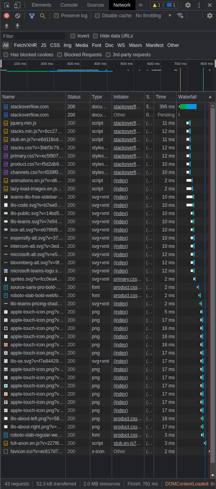
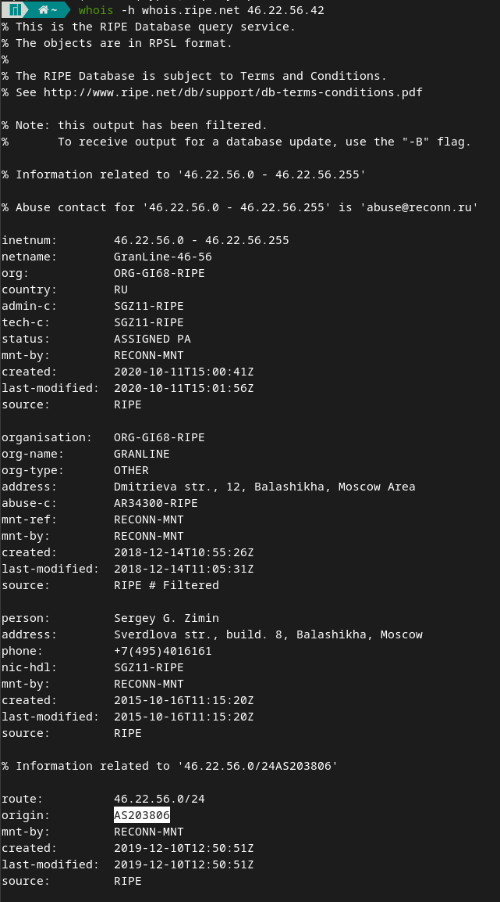
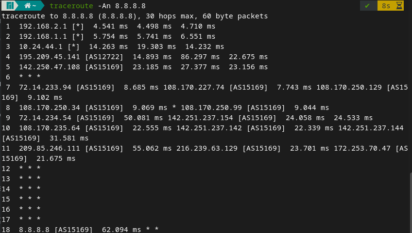
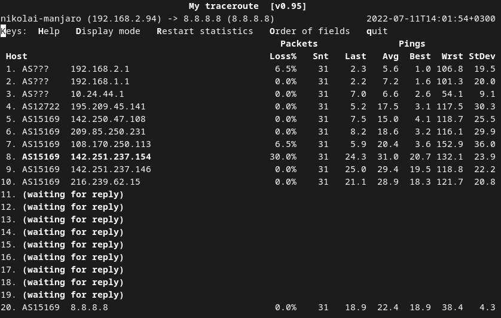
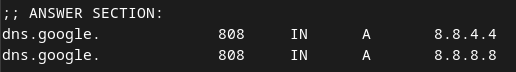
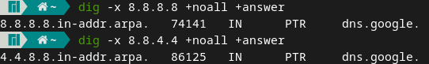

Домашнее задание к занятию "3.6. Компьютерные сети, лекция 1"  

1. `telnet stackoverflow.com 80`  
   HTTP/1.1 301 Moved Permanently  
   Означает, что запрашиваемый ресурс перемещен на постоянной основе. В поле location указывается новый адрес - https://stackoverflow.com/questions (тот же адрес, но по протоколу https)  

2.     
  ```
   Request URL: http://stackoverflow.com/
   Request Method: GET
   Status Code: 200 Internal Redirect
  ```
  Дольше всего обрабатывался GET запрос по адресу `https://stackoverflow.com`  
    

3. `dig @resolver4.opendns.com myip.opendns.com +short`
   46.22.56.42  
   Такой же адрес получен на сайте whoer.net  

4. `whois -h whois.ripe.net 46.22.56.42`
   Провайдер - GRANLINE  
   AS - AS203806  
     

5.
     

6. Худший результат был на 7 участке (AS15169) 108.170.250.113  
     

7. `dig dns.google`  
     

8. 
   
