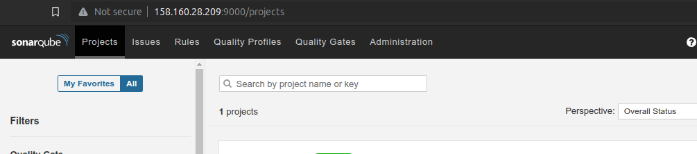
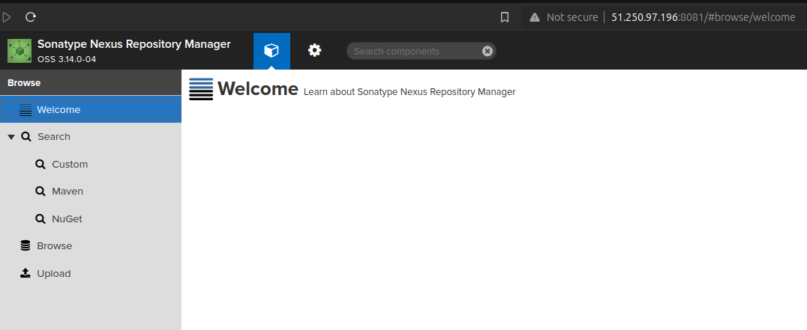
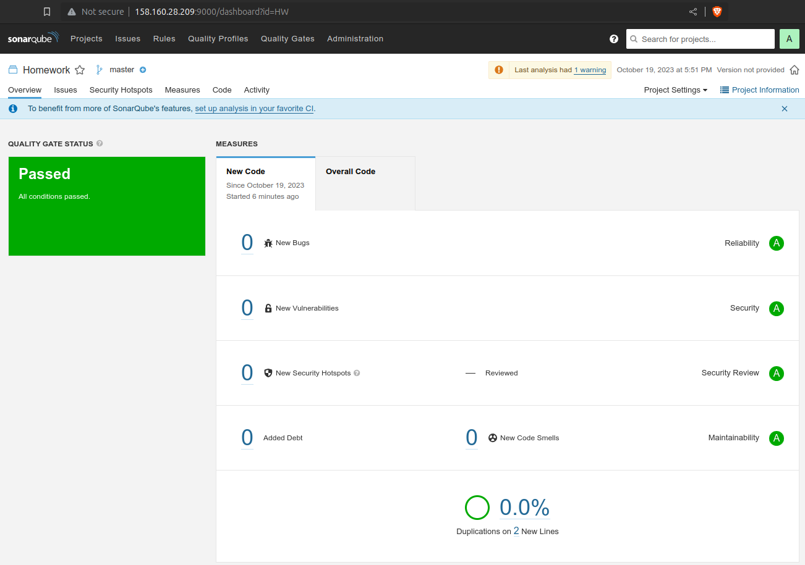

# Домашнее задание к занятию 9 «Процессы CI/CD»
  
## Подготовка к выполнению:  
  
Подготовлены 2 виртуальные машины в Яндекс Облаке и выполнены плейбуки. SonarQube и Nexus доступны:  
  
SonarQube  
  
  
Nexus  

  
## Знакомоство с SonarQube  
  
Все шаги успшено пройдены, произведен анализ кода из файла fail.py. Далее устранены найденные ошибки и предупреждения, произведен повторный анализ. Скриншот успешного прохождения:  
  
  
  
## Знакомство с Nexus  
  
В Nexus загружены 2 артефакта с указанными в домашнем задании параметрами:  
```
groupId: netology
artifactId: java
version: 8_282
classifier: distrib
type: tar.gz

groupId: netology
artifactId: java
version: 8_102
classifier: distrib
type: tar.gz
```  
В директории `files` в текущем репозитории располагается файл [maven-metadata.xml](files/maven-metadata.xml).  
  
### Знакомство с Maven  
  
Далее скачан дистрибутив Maven и подготовлен к работе. С помощью pom-файла успешно скачан загруженный в Nexus артефакт.  
Отредактированный [pom-файл](/files/pom.xml) также располагается в директории `files` текущего репозитория.
