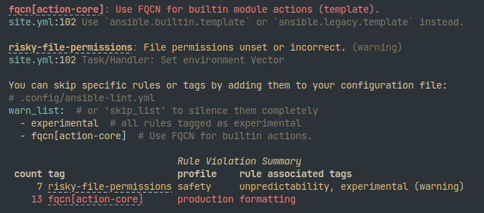
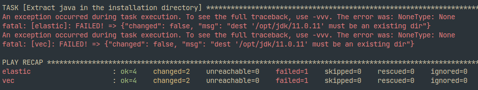
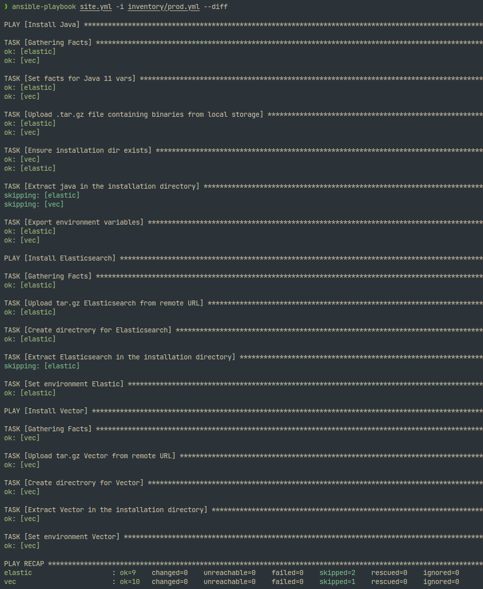

# Домашнее задание к занятию "2. Работа с Playbook"
___
  
1. Приготовьте свой собственный inventory файл `prod.yml`:  
  
    В качестве хостов будут использоваться docker контейнеры elastic и vec для Elasticsearch и Vector соответственно.   
    ```yml
    ---
    elasticsearch:
    hosts:
        elastic:
        ansible_connection: docker
    vector:
    hosts:
        vec:
        ansible_connection: docker
    ```  
  
2. Допишите playbook: нужно сделать ещё один *play*, который устанавливает и настраивает *vector*.  
  
3. При создании tasks рекомендую использовать модули: `get_url`, `template`, `unarchive`, `file`.   
  
4. Tasks должны: скачать нужной версии дистрибутив, выполнить распаковку в выбранную директорию, установить *vector*:  
    В [playbook](https://github.com/nikryl/devops-netology/blob/08-ansible-02-playbook/playbook/site.yml) добавлен *play* с 4 новыми *task*  
        - `Upload tar.gz Vector from remote URL` - скачивание архива tar.gz на хост vec
        - `Create directrory for Vector` - создание установочной директории Vector
        - `Extract Vector in the installation directory` - разархивирование/установка Vector
        - `Set environment Vector` - создание переменных окружения для Vector
  
5. Запустите `ansible-lint site.yml` и исправьте ошибки, если они есть:  
    Сперва `ansible-lint` ругался на  
      
    Поэтому все модули в *playbook* были переписаны с использование полного названия модулей `ansible.builtin....`, а к *tasks* был добавлен параметр `mode`.  
  
6. Попробуйте запустить playbook на этом окружении с флагом `--check`:  
      
    Проверка завершается с ошибкой, т.к. не существует директория, которая создается в предыдущей *task*.  
  
7. Запустите playbook на prod.yml окружении с флагом --diff. Убедитесь, что изменения на системе произведены:  
      
  
8. Повторно запустите playbook с флагом --diff и убедитесь, что playbook идемпотентен:  
      
  
9. Подготовьте README.md файл по своему playbook. В нём должно быть описано: что делает playbook, какие у него есть параметры и теги:
    - В *playbook* в первом *play* производится установка Java на всех хостах. Установочный файл копируется из локальной машины, распаковывается в указанную директорию, создаются переменные окружения. Для всех *task* в этом *play* используется тэг *java*
    - Во втором *play* на хосте *elastic* происходит установка Elasticsearch. Скачивается .tar.gz архив с официального сайта разработчика, распаковывается в указанную директорию на хосте, создаются переменные окружения. Тэги *elastic* для всех *task*.
    - В третьем *play* на хосте *vec* происходит установка Vector по аналогии с Elasticsearch. Используются тэги *vector*.
  
10. Готовый playbook выложите в свой репозиторий, поставьте тег 08-ansible-02-playbook на фиксирующий коммит, в ответ предоставьте ссылку на него.
