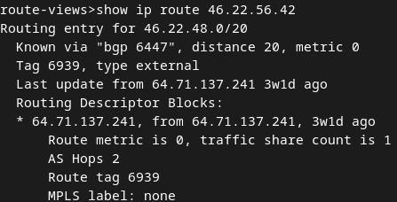
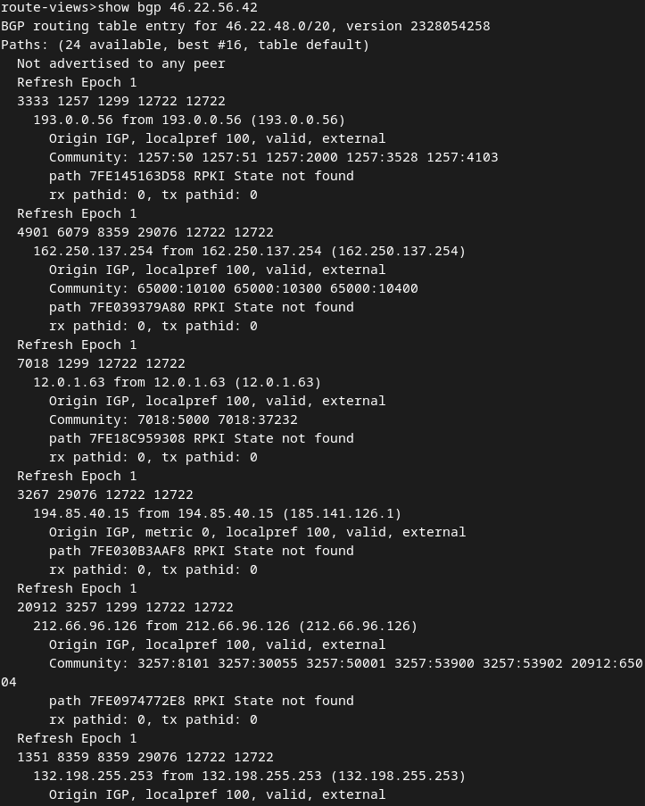
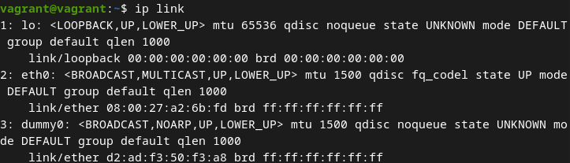
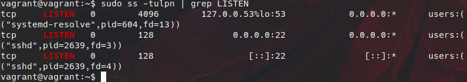
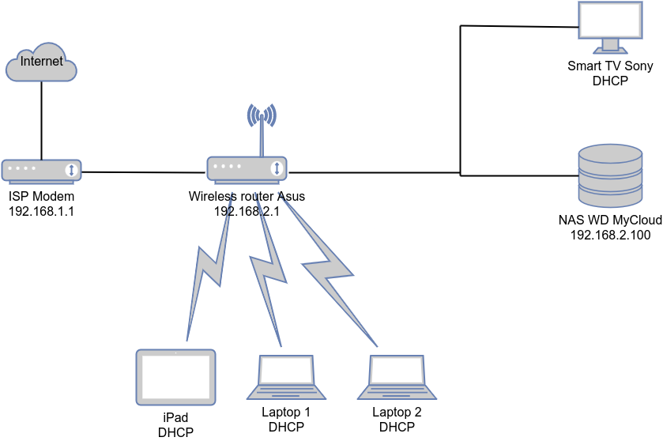

Домашнее задание к занятию "3.8. Компьютерные сети, лекция 3"  

1. Подключение выполнено  
     
     

2. Добавлен dummy интерфейс в конфиг **/etc/network/iterfaces**:  
     
   С помощью команды `ip route add` добавлено 3 временных статических маршрута (3 нижних на скриншоте):  
     

3. Проверить открытые TCP и UDP порты можно любой из следующих команд:
   ```
   sudo lsof -i -P -n | grep LISTEN
   sudo netstat -tulpn | grep LISTEN
   sudo ss -tulpn | grep LISTEN
   ```
    
   На виртуальной машине открыто 2 TCP порта - 22 и 53. Порт 22 используется SSH, с помощью которого осуществлено подключение к этой ВМ. Порт 53 открыт по умолчанию и используется протоколом DNS.

4. Посмореть открытые порты UDP можно с помощью тех же команд, что и в задании 3. В виртуальной машине vagrant, настроенной в предыдущих домашних заданиях, открытых портов UDP нет.

5.  Создана диаграмма домашней сети
   