# Домашнее задание к занятию "3.5. Файловые системы"  

1. Разреженные файлы предназначены для более эффективного использования дискового пространства. Вместо записи пустых блоков хранится информация о их последовательности в метаданных. При чтении разреженных файлов файловая система прозрачным образом преобразует инфо из метаданных в реальные пустые блоки во время выполнения операции. Приложения об этом даже не подозревают :)  
   Создать разреженный файл можно с помощью `truncate -s SIZE FILE`. При этом у файла будут 2 разных размера - фактический и видимый:  
   ```bash
   # создать новый разреженный файл
   truncate -s 100M sparse_file.txt
   # посмотреть фактический размер файла (в нашем случае вывод будет 0)
   du -h sparse_file.txt
   # посмотреть видимый размер файла (вывод покажет размер, указанный при создании - 100MB)
   du -h --apparent-size sparse_file.txt
   ```  
2. Не могут, т.к. у них один и тот же inode и они представляют собой ссылку на один и тот же файл. Убедился в этом проведя эксперимент. При изменении прав доступа для hardlink'а, они меняются и в оригинальном файле.   
3. 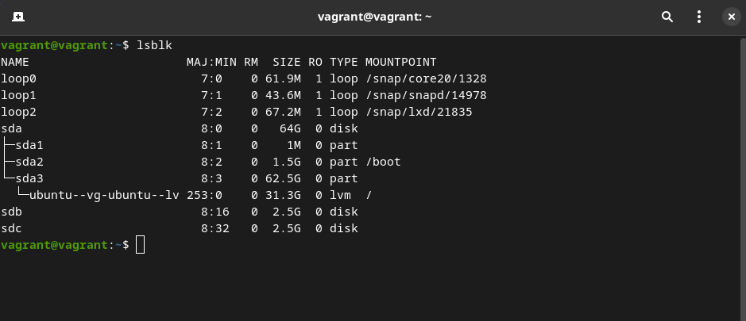  
4. 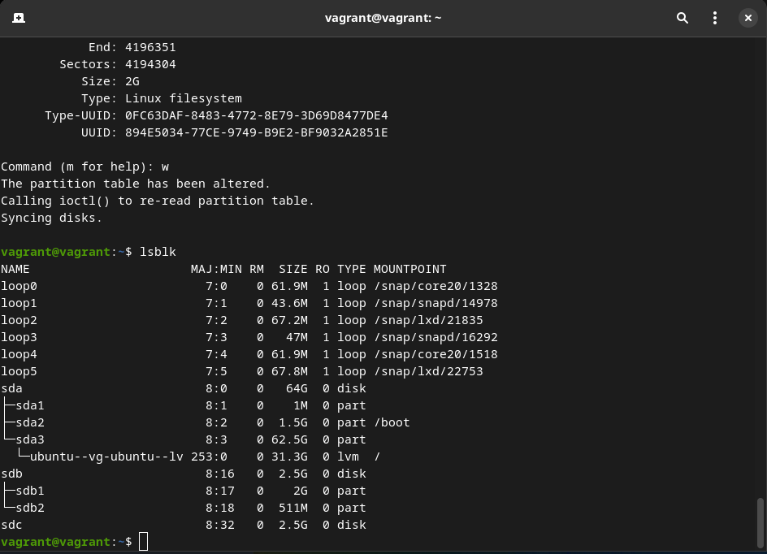   
5. `sudo sfdisk -d /dev/sdb | sudo sfdisk /dev/sdc`  
   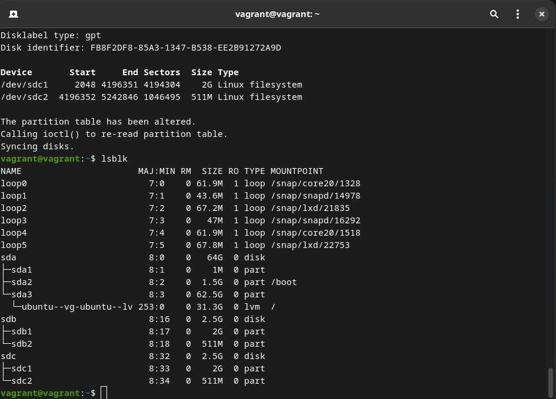  
6. `sudo mdadm --create /dev/md1 --level=raid1 --raid-devices=2 /dev/sdb1 /dev/sdc1`  
   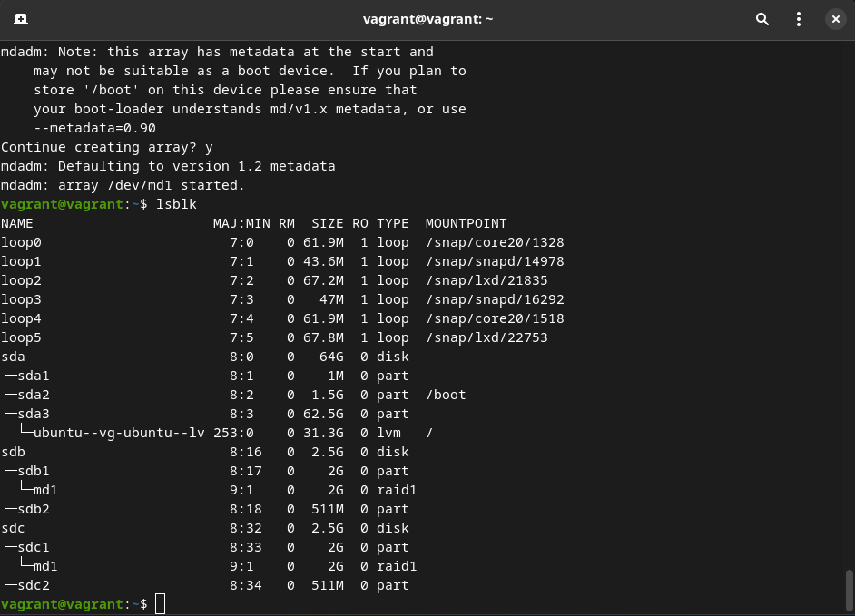  
7. `sudo mdadm --create /dev/md0 --level=raid0 --raid-devices=2 /dev/sdb2 /dev/sdc2`  
   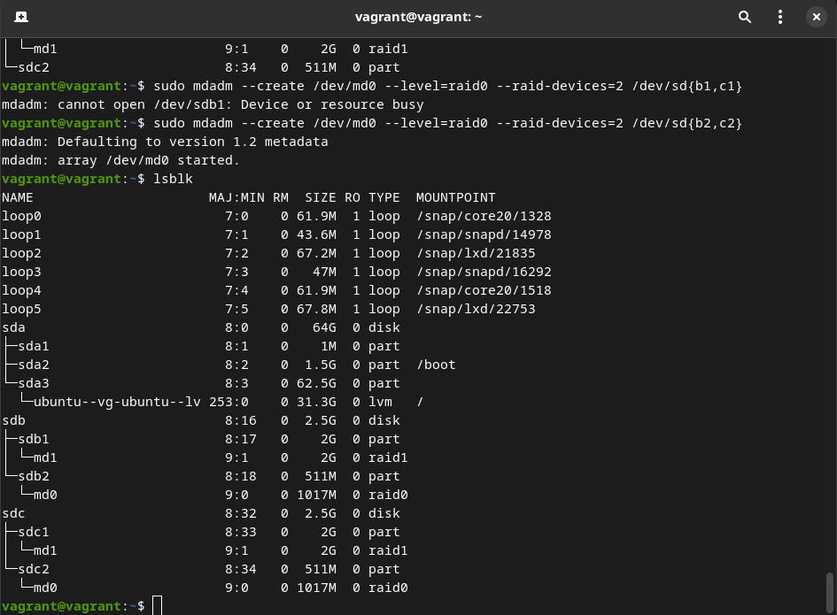  
8. 
   ```bash
   sudo pvcreate /dev/md1 /dev/md0
   pvdisplay
   ```
   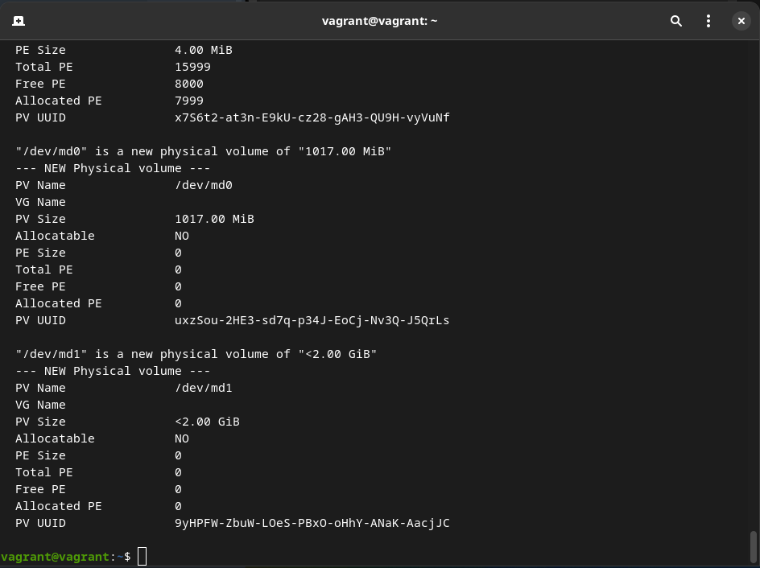  
9. 
   ```bash
   vgcreate VG /dev/md1 /dev/md0
   vgdisplay
   ```
   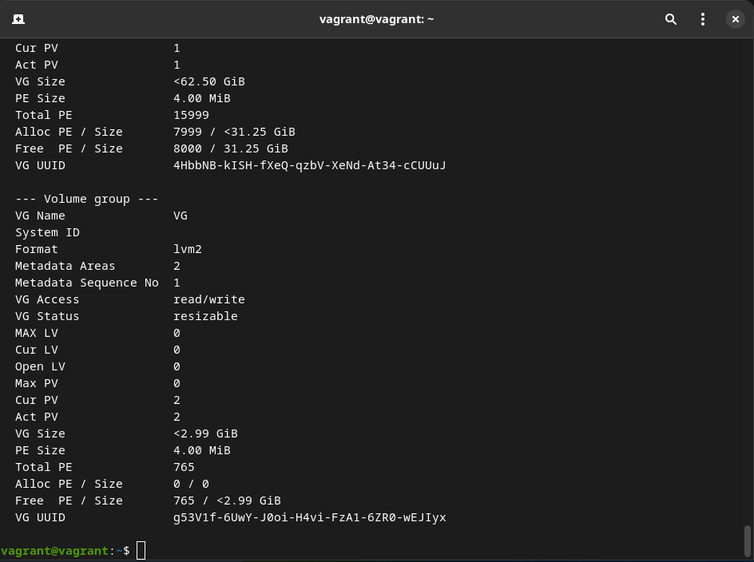  
10. 
   ```bash
   sudo lvcreate -L 100M --name lv100m vg /dev/md0
   sudo lvdisplay
   ```
   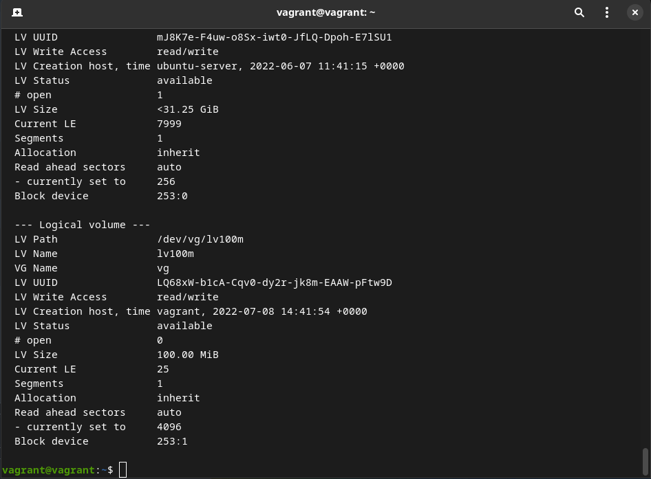  
11. `sudo mkfs.ext4 /dev/vg/lv100m` 
   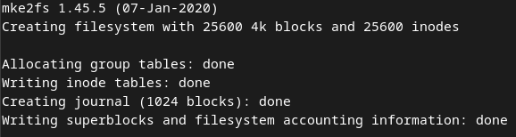  
12.
   ```bash
   mkdir /tmp/new_dir
   sudo mount /dev/vg/lv100m /tmp/new_dir/
   ```
13. `wget https://mirror.yandex.ru/ubuntu/ls-lR.gz -O /tmp/new_dir/test.gz`  
   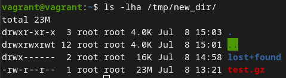 
14. 
   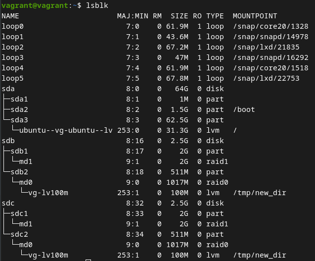  
15. 
   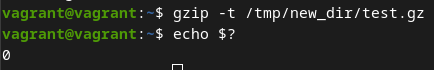  
16. `sudo pvmove /dev/md0 /dev/md1`
    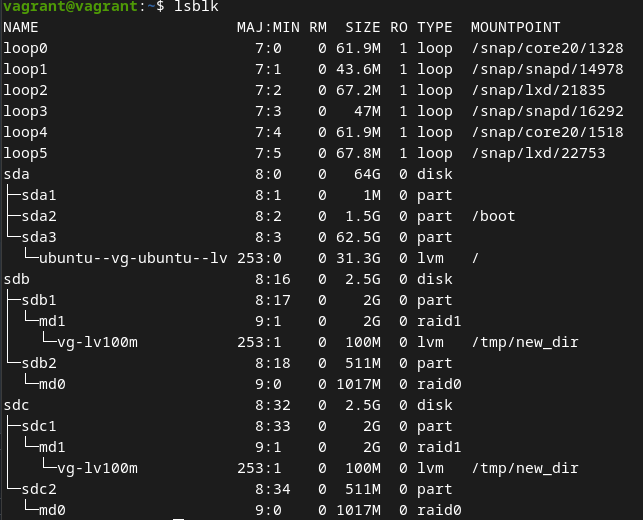  
17. `sudo mdadm -f /dev/md1 /dev/sdc1`
   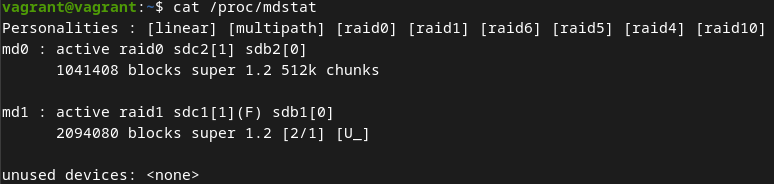 
18. 
   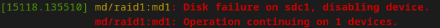 
19. 
   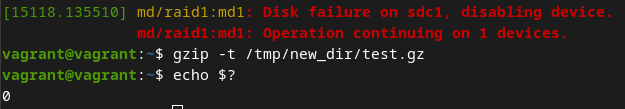 
20. Ну раз надо, значит надо :)
   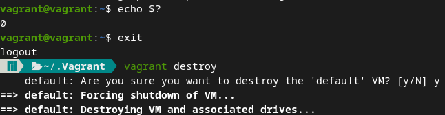 