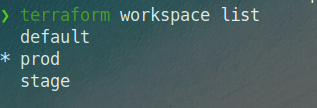

# Домашнее задание к занятию "7.3. Основы и принцип работы Терраформ"
___
## Задача 1
___

Создан S3 бэкенд в Яндекс облаке. В файл main.tf настроено использование бэкенда:

```terraform
backend "s3" {
endpoint   = "storage.yandexcloud.net"
bucket     = "nikryl-netology-state"
region     = "ru-central1"
key        = "dev/iac7.3/terraform.tfstate"

skip_region_validation      = true
skip_credentials_validation = true
}
```

___
## Задача 2
___
Не нашел в Яндекс Облаке аналога *intance_type*, вместо него по тому же принципу выбирал *platform_id* в зависимости от текущего воркспейса. Конфигурация описана в файле [main.tf](https://github.com/nikryl/devops-netology/blob/iac7.3/terraform/main.tf)  

Вывод `terraform workspace list`  
  
Вывод `terraform plan`:

```
❯ terraform plan

Terraform used the selected providers to generate the following execution plan. Resource actions are indicated with the following symbols:
  + create

Terraform will perform the following actions:

  # yandex_compute_instance.netology[0] will be created
  + resource "yandex_compute_instance" "netology" {
      + created_at                = (known after apply)
      + folder_id                 = (known after apply)
      + fqdn                      = (known after apply)
      + hostname                  = (known after apply)
      + id                        = (known after apply)
      + metadata                  = {
          + "ssh-keys" = <<-EOT
                ubuntu:ssh-rsa AAAAB3NzaC1yc2EAAAADAQABAAACAQCzLzii3HYJvW6Nw2cJ79D4iWidzz04ynSCXZHoAG/0Zuo1Ua2rQ9ddwM2IWgOu5UOzbe660sBLMlrLTKUYrg5Fdj0XnM74fa2cqi9RU51KSvBgm+GMt/o7mocG0hCsSVwKe08OY9FhrAoeaTfeHpG0Numm2yGXac6rDUoaTLW9e/6vZc/LG+eddvUXota1LedEiUHspFfypBq99IC83wlZ+ERAFmOJ4W9Lhc7bpWqHMq4OwF/4ZTiHk2qV5r68u/xsh+Wf/s5H3tuQvvb/dy2pZirTWEUk+RjXIXM39Tw0gxmhwvHoI4dMNmtXwhCcFU/jaoOtwaejr0qkA6hc4Z/2Z10tdrxm07JUghVCaI2ckmEBzQoZ8vxmcT5+UU3BSHgpSt2qPoBophhwd1S/IaafLMC+7z078oY7pR83Ljd0+/44HN029p6mKaeIFfSa+ucO+BID+kMz2bNI2bLP5cNq12Xfb1gwQF0H9IYAbXgvFv/guA0Er95bnoYul2FTt6hloOWoWGkcN0nLaPJGjoW5xKvYwCAFXDQyiWmT6DVsy1aRVGcZbPi8vL/WwUDOkDs8d0tZUoE492Iiw4ko9xIMXeHstYv1pIp6RHa5y+z1mc+ymCNqdzOb4IOwJqPMJ8j3LoiXzCIyc9sesPfZ2eqcOuv2MAG59KOGxrTqqEIbnw== nikryl@gmail.com
            EOT
        }
      + name                      = "netology-0"
      + network_acceleration_type = "standard"
      + platform_id               = "standard-v2"
      + service_account_id        = (known after apply)
      + status                    = (known after apply)
      + zone                      = (known after apply)

      + boot_disk {
          + auto_delete = true
          + device_name = (known after apply)
          + disk_id     = (known after apply)
          + mode        = (known after apply)

          + initialize_params {
              + block_size  = (known after apply)
              + description = (known after apply)
              + image_id    = "fd8bh0c781u19q50m4kj"
              + name        = (known after apply)
              + size        = (known after apply)
              + snapshot_id = (known after apply)
              + type        = "network-hdd"
            }
        }

      + network_interface {
          + index              = (known after apply)
          + ip_address         = (known after apply)
          + ipv4               = true
          + ipv6               = (known after apply)
          + ipv6_address       = (known after apply)
          + mac_address        = (known after apply)
          + nat                = true
          + nat_ip_address     = (known after apply)
          + nat_ip_version     = (known after apply)
          + security_group_ids = (known after apply)
          + subnet_id          = (known after apply)
        }

      + placement_policy {
          + host_affinity_rules = (known after apply)
          + placement_group_id  = (known after apply)
        }

      + resources {
          + core_fraction = 100
          + cores         = 2
          + memory        = 4
        }

      + scheduling_policy {
          + preemptible = (known after apply)
        }
    }

  # yandex_compute_instance.netology[1] will be created
  + resource "yandex_compute_instance" "netology" {
      + created_at                = (known after apply)
      + folder_id                 = (known after apply)
      + fqdn                      = (known after apply)
      + hostname                  = (known after apply)
      + id                        = (known after apply)
      + metadata                  = {
          + "ssh-keys" = <<-EOT
                ubuntu:ssh-rsa AAAAB3NzaC1yc2EAAAADAQABAAACAQCzLzii3HYJvW6Nw2cJ79D4iWidzz04ynSCXZHoAG/0Zuo1Ua2rQ9ddwM2IWgOu5UOzbe660sBLMlrLTKUYrg5Fdj0XnM74fa2cqi9RU51KSvBgm+GMt/o7mocG0hCsSVwKe08OY9FhrAoeaTfeHpG0Numm2yGXac6rDUoaTLW9e/6vZc/LG+eddvUXota1LedEiUHspFfypBq99IC83wlZ+ERAFmOJ4W9Lhc7bpWqHMq4OwF/4ZTiHk2qV5r68u/xsh+Wf/s5H3tuQvvb/dy2pZirTWEUk+RjXIXM39Tw0gxmhwvHoI4dMNmtXwhCcFU/jaoOtwaejr0qkA6hc4Z/2Z10tdrxm07JUghVCaI2ckmEBzQoZ8vxmcT5+UU3BSHgpSt2qPoBophhwd1S/IaafLMC+7z078oY7pR83Ljd0+/44HN029p6mKaeIFfSa+ucO+BID+kMz2bNI2bLP5cNq12Xfb1gwQF0H9IYAbXgvFv/guA0Er95bnoYul2FTt6hloOWoWGkcN0nLaPJGjoW5xKvYwCAFXDQyiWmT6DVsy1aRVGcZbPi8vL/WwUDOkDs8d0tZUoE492Iiw4ko9xIMXeHstYv1pIp6RHa5y+z1mc+ymCNqdzOb4IOwJqPMJ8j3LoiXzCIyc9sesPfZ2eqcOuv2MAG59KOGxrTqqEIbnw== nikryl@gmail.com
            EOT
        }
      + name                      = "netology-1"
      + network_acceleration_type = "standard"
      + platform_id               = "standard-v2"
      + service_account_id        = (known after apply)
      + status                    = (known after apply)
      + zone                      = (known after apply)

      + boot_disk {
          + auto_delete = true
          + device_name = (known after apply)
          + disk_id     = (known after apply)
          + mode        = (known after apply)

          + initialize_params {
              + block_size  = (known after apply)
              + description = (known after apply)
              + image_id    = "fd8bh0c781u19q50m4kj"
              + name        = (known after apply)
              + size        = (known after apply)
              + snapshot_id = (known after apply)
              + type        = "network-hdd"
            }
        }

      + network_interface {
          + index              = (known after apply)
          + ip_address         = (known after apply)
          + ipv4               = true
          + ipv6               = (known after apply)
          + ipv6_address       = (known after apply)
          + mac_address        = (known after apply)
          + nat                = true
          + nat_ip_address     = (known after apply)
          + nat_ip_version     = (known after apply)
          + security_group_ids = (known after apply)
          + subnet_id          = (known after apply)
        }

      + placement_policy {
          + host_affinity_rules = (known after apply)
          + placement_group_id  = (known after apply)
        }

      + resources {
          + core_fraction = 100
          + cores         = 2
          + memory        = 4
        }

      + scheduling_policy {
          + preemptible = (known after apply)
        }
    }

  # yandex_compute_instance.netology-2["instance1"] will be created
  + resource "yandex_compute_instance" "netology-2" {
      + created_at                = (known after apply)
      + folder_id                 = (known after apply)
      + fqdn                      = (known after apply)
      + hostname                  = (known after apply)
      + id                        = (known after apply)
      + metadata                  = {
          + "ssh-keys" = <<-EOT
                ubuntu:ssh-rsa AAAAB3NzaC1yc2EAAAADAQABAAACAQCzLzii3HYJvW6Nw2cJ79D4iWidzz04ynSCXZHoAG/0Zuo1Ua2rQ9ddwM2IWgOu5UOzbe660sBLMlrLTKUYrg5Fdj0XnM74fa2cqi9RU51KSvBgm+GMt/o7mocG0hCsSVwKe08OY9FhrAoeaTfeHpG0Numm2yGXac6rDUoaTLW9e/6vZc/LG+eddvUXota1LedEiUHspFfypBq99IC83wlZ+ERAFmOJ4W9Lhc7bpWqHMq4OwF/4ZTiHk2qV5r68u/xsh+Wf/s5H3tuQvvb/dy2pZirTWEUk+RjXIXM39Tw0gxmhwvHoI4dMNmtXwhCcFU/jaoOtwaejr0qkA6hc4Z/2Z10tdrxm07JUghVCaI2ckmEBzQoZ8vxmcT5+UU3BSHgpSt2qPoBophhwd1S/IaafLMC+7z078oY7pR83Ljd0+/44HN029p6mKaeIFfSa+ucO+BID+kMz2bNI2bLP5cNq12Xfb1gwQF0H9IYAbXgvFv/guA0Er95bnoYul2FTt6hloOWoWGkcN0nLaPJGjoW5xKvYwCAFXDQyiWmT6DVsy1aRVGcZbPi8vL/WwUDOkDs8d0tZUoE492Iiw4ko9xIMXeHstYv1pIp6RHa5y+z1mc+ymCNqdzOb4IOwJqPMJ8j3LoiXzCIyc9sesPfZ2eqcOuv2MAG59KOGxrTqqEIbnw== nikryl@gmail.com
            EOT
        }
      + name                      = "instance1"
      + network_acceleration_type = "standard"
      + platform_id               = "standard-v1"
      + service_account_id        = (known after apply)
      + status                    = (known after apply)
      + zone                      = (known after apply)

      + boot_disk {
          + auto_delete = true
          + device_name = (known after apply)
          + disk_id     = (known after apply)
          + mode        = (known after apply)

          + initialize_params {
              + block_size  = (known after apply)
              + description = (known after apply)
              + image_id    = "fd8bh0c781u19q50m4kj"
              + name        = (known after apply)
              + size        = (known after apply)
              + snapshot_id = (known after apply)
              + type        = "network-hdd"
            }
        }

      + network_interface {
          + index              = (known after apply)
          + ip_address         = (known after apply)
          + ipv4               = true
          + ipv6               = (known after apply)
          + ipv6_address       = (known after apply)
          + mac_address        = (known after apply)
          + nat                = true
          + nat_ip_address     = (known after apply)
          + nat_ip_version     = (known after apply)
          + security_group_ids = (known after apply)
          + subnet_id          = (known after apply)
        }

      + placement_policy {
          + host_affinity_rules = (known after apply)
          + placement_group_id  = (known after apply)
        }

      + resources {
          + core_fraction = 100
          + cores         = 2
          + memory        = 4
        }

      + scheduling_policy {
          + preemptible = (known after apply)
        }
    }

  # yandex_compute_instance.netology-2["instance2"] will be created
  + resource "yandex_compute_instance" "netology-2" {
      + created_at                = (known after apply)
      + folder_id                 = (known after apply)
      + fqdn                      = (known after apply)
      + hostname                  = (known after apply)
      + id                        = (known after apply)
      + metadata                  = {
          + "ssh-keys" = <<-EOT
                ubuntu:ssh-rsa AAAAB3NzaC1yc2EAAAADAQABAAACAQCzLzii3HYJvW6Nw2cJ79D4iWidzz04ynSCXZHoAG/0Zuo1Ua2rQ9ddwM2IWgOu5UOzbe660sBLMlrLTKUYrg5Fdj0XnM74fa2cqi9RU51KSvBgm+GMt/o7mocG0hCsSVwKe08OY9FhrAoeaTfeHpG0Numm2yGXac6rDUoaTLW9e/6vZc/LG+eddvUXota1LedEiUHspFfypBq99IC83wlZ+ERAFmOJ4W9Lhc7bpWqHMq4OwF/4ZTiHk2qV5r68u/xsh+Wf/s5H3tuQvvb/dy2pZirTWEUk+RjXIXM39Tw0gxmhwvHoI4dMNmtXwhCcFU/jaoOtwaejr0qkA6hc4Z/2Z10tdrxm07JUghVCaI2ckmEBzQoZ8vxmcT5+UU3BSHgpSt2qPoBophhwd1S/IaafLMC+7z078oY7pR83Ljd0+/44HN029p6mKaeIFfSa+ucO+BID+kMz2bNI2bLP5cNq12Xfb1gwQF0H9IYAbXgvFv/guA0Er95bnoYul2FTt6hloOWoWGkcN0nLaPJGjoW5xKvYwCAFXDQyiWmT6DVsy1aRVGcZbPi8vL/WwUDOkDs8d0tZUoE492Iiw4ko9xIMXeHstYv1pIp6RHa5y+z1mc+ymCNqdzOb4IOwJqPMJ8j3LoiXzCIyc9sesPfZ2eqcOuv2MAG59KOGxrTqqEIbnw== nikryl@gmail.com
            EOT
        }
      + name                      = "instance2"
      + network_acceleration_type = "standard"
      + platform_id               = "standard-v1"
      + service_account_id        = (known after apply)
      + status                    = (known after apply)
      + zone                      = (known after apply)

      + boot_disk {
          + auto_delete = true
          + device_name = (known after apply)
          + disk_id     = (known after apply)
          + mode        = (known after apply)

          + initialize_params {
              + block_size  = (known after apply)
              + description = (known after apply)
              + image_id    = "fd8bh0c781u19q50m4kj"
              + name        = (known after apply)
              + size        = (known after apply)
              + snapshot_id = (known after apply)
              + type        = "network-hdd"
            }
        }

      + network_interface {
          + index              = (known after apply)
          + ip_address         = (known after apply)
          + ipv4               = true
          + ipv6               = (known after apply)
          + ipv6_address       = (known after apply)
          + mac_address        = (known after apply)
          + nat                = true
          + nat_ip_address     = (known after apply)
          + nat_ip_version     = (known after apply)
          + security_group_ids = (known after apply)
          + subnet_id          = (known after apply)
        }

      + placement_policy {
          + host_affinity_rules = (known after apply)
          + placement_group_id  = (known after apply)
        }

      + resources {
          + core_fraction = 100
          + cores         = 4
          + memory        = 8
        }

      + scheduling_policy {
          + preemptible = (known after apply)
        }
    }

  # yandex_vpc_network.network will be created
  + resource "yandex_vpc_network" "network" {
      + created_at                = (known after apply)
      + default_security_group_id = (known after apply)
      + folder_id                 = (known after apply)
      + id                        = (known after apply)
      + labels                    = (known after apply)
      + name                      = "network"
      + subnet_ids                = (known after apply)
    }

  # yandex_vpc_subnet.subnet will be created
  + resource "yandex_vpc_subnet" "subnet" {
      + created_at     = (known after apply)
      + folder_id      = (known after apply)
      + id             = (known after apply)
      + labels         = (known after apply)
      + name           = "subnet"
      + network_id     = (known after apply)
      + v4_cidr_blocks = [
          + "192.168.101.0/24",
        ]
      + v6_cidr_blocks = (known after apply)
      + zone           = "ru-central1-a"
    }

Plan: 6 to add, 0 to change, 0 to destroy.
```