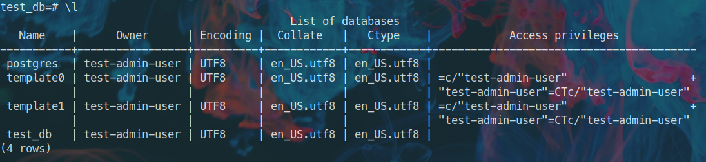
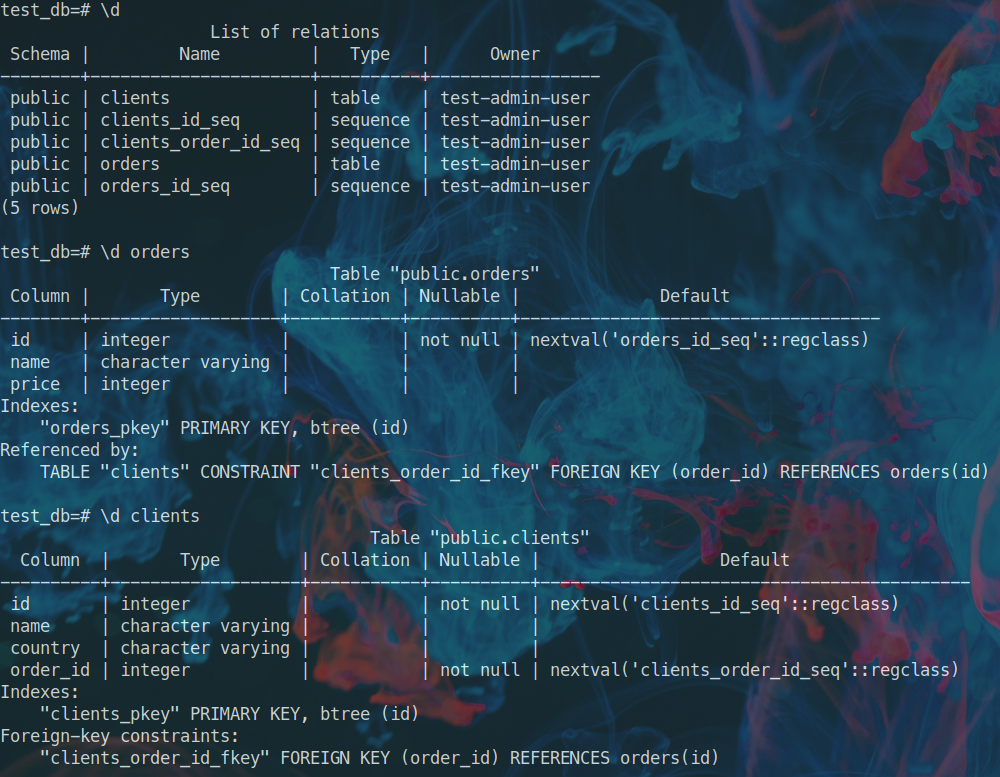
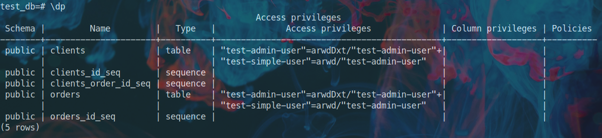
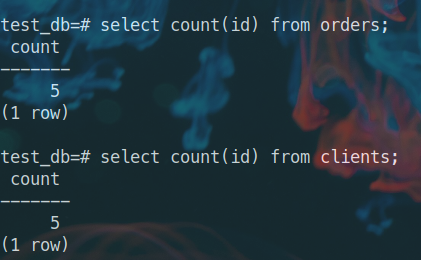
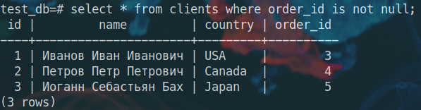
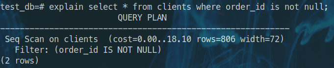
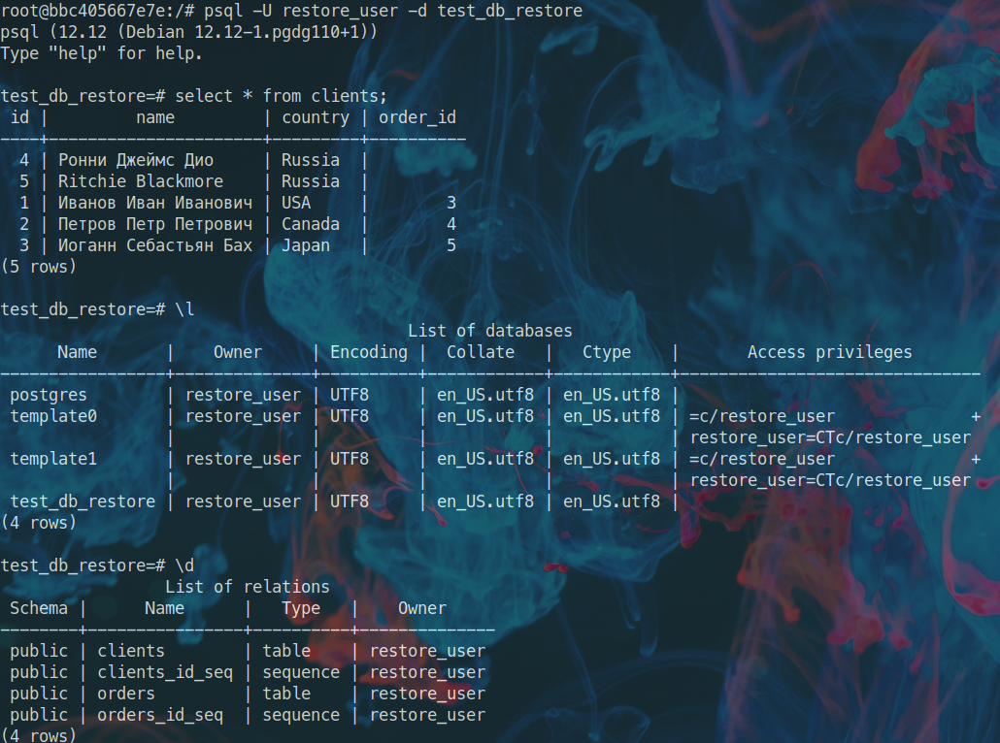

# Домашнее задание к занятию "6.2. SQL"
___
## Задача 1
___

```yml
version: "3.9"
services:
  db:
    container_name: postgres
    image: postgres:12
    ports:
      - 5432:5432
    environment:
      POSTGRES_USER: test-admin-user
      POSTGRES_PASSWORD: postgres
      POSTGRES_DB: test_db
    volumes:
      - /home/nikolai/Documents/Study/repos/docker/data:/var/lib/postgresql/data
      - /home/nikolai/Documents/Study/repos/docker/backup:/data/backup
volumes:
  data:
  backup:
```

Порт 5432 был проброшен для возможности использования клиента SQL (например DBeaver). Для подключения напрямую к нашему контейнеру и работы с psql использую команду `docker exec -it postgres psql -U test-admin-user -d test_db`.
  
___
## Задача 2
___

- База данных и пользователь были созданы в docker-compose файле. Пример создания пользователя с помощью SQL синтаксиса будет далее в задании, при необходимости создания БД можно воспользоваться запросом `create database test_db;` при использовании psql переключиться на новую БД можно с помощью `\c test_db`.

- Создание таблиц `orders` и `clients`:
```sql
create table orders(id serial primary key, name varchar, price integer);
create table clients (id serial primary key,name varchar, country varchar, order_id integer references orders(id));
```

- Предоставление прав на таблицы *orders* и *clients* для пользователя *test-admin-user*:
```sql
grant all on orders, clients to "test-admin-user";
```

- Создание пользователя *test-simple-user*:
```sql
create user "test-simple-user";
```

___
Итог

- Список БД
  

  Или `SELECT datname FROM pg_database;`

 - Описание таблиц
   

   Или

 ```sql
SELECT table_name, column_name, data_type 
FROM information_schema.columns
WHERE table_name = 'orders';
```

- Права пользователей над таблицами
```sql
SELECT grantee, privilege_type, table_name, table_catalog 
FROM information_schema.role_table_grants rtg 
WHERE table_name in ('orders', 'clients') 
```

- Список пользователей
  
___
## Задача 3
___

Вставка данных

```sql
insert into orders (name, price) values ('Шоколад', 10),('Принтер', 3000),('Книга',500),('Монитор',7000),('Гитара',4000);

insert into clients (name, country) values 
	('Иванов Иван Иванович','USA')
   ,('Петров Петр Петрович','Canada')
   ,('Иоганн Себастьян Бах','Japan')
   ,('Ронни Джеймс Дио','Russia')
   ,('Ritchie Blackmore','Russia');
```
___
Итог

Запрос на количество записей в таблицах и результат выполнения:


___
## Задача 4
___

- Добавление данных о заказе в таблицу *clients*:

```sql
update clients 
set order_id = (select id from orders where name='Книга') 
where name='Иванов Иван Иванович';

update clients 
set order_id = (select id from orders where name='Монитор') 
where name='Петров Петр Петрович';

update clients 
set order_id = (select id from orders where name='Гитара') 
where name='Иоганн Себастьян Бах';
```

- Выдача пользователей
  

___
## Задача 5
___



- **seq scan** означает, что планировщик выбрал последовательное сканирование таблицы
- **cost** приблизительная (предварительная) стоимость выполнения операции. Первое значение **cost** на получение первой строки, второй значение - на получение всех строк
- **rows** ожидаемое количество возвращаемых строк. Предполагается, что запрос выполняет до конца
- **width** ожидаемые средний размер возвращаемых строк (в байтах)

___
## Задача 6
___

```bash
❯ docker exec -it postgres /bin/bash
root@eb48b42498df:/# pg_dump -U test-admin-user test_db > /data/backup/test_db_backup.sql
root@eb48b42498df:/# ls /data/backup/
test_db_backup.sql
root@eb48b42498df:/# exit
exit
❯
❯
❯ docker stop postgres
postgres
❯ docker ps
CONTAINER ID   IMAGE     COMMAND   CREATED   STATUS    PORTS     NAMES
❯
❯
❯ docker run --name postgres2 -e POSTGRES_USER=restore_user -e POSTGRES_PASSWORD=postgres -e POSTGRES_DB=test_db_restore -d -v /home/nikolai/Documents/Study/repos/docker/backup:/data/backup postgres:12
bbc405667e7ea15860b729e04b27b27ec0a530bd29a1d139bd12c139e9780b7c
❯ docker exec -it postgres2 /bin/bash
root@bbc405667e7e:/# ls /data/backup/
test_db_backup.sql
root@bbc405667e7e:/# psql test_db_restore -U restore_user < /data/backup/test_db_backup.sql

```



Но в целом если мы монтируем общий *volume* двух контейнеров postgres в `/var/lib//postgresql/data`, то при создании нового контейнера все наши роли и данные сохраняются и работают без дополнительных манипуляций.