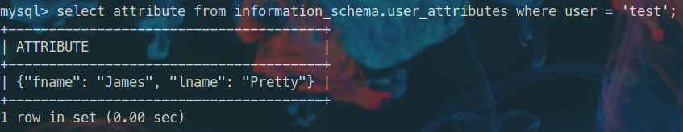
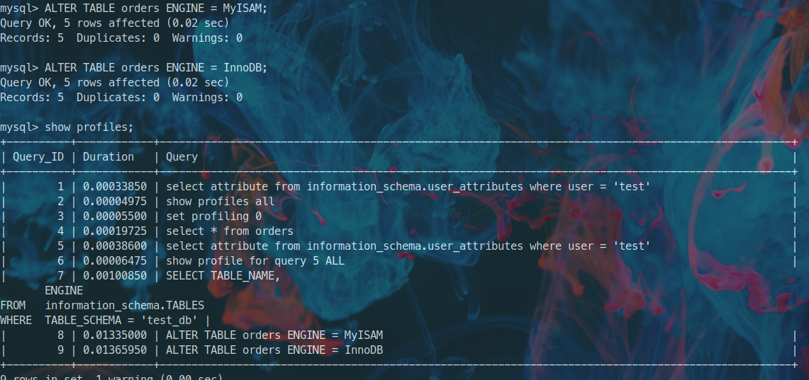

# Домашнее задание к занятию "6.3. MySQL"
___
## Задача 1
___

```bash
# Запуск mysql в docker
docker run --name mysql -e MYSQL_ROOT_PASSWORD=mysql -e MYSQL_DATABASE=test_db -v /data/mysql_backup:/data/backup -p 3306:3306 -d mysql:8

# Подключение к контейнеру
docker exec -it mysql bash

# Восстановление из бэкапа
mysql -p test_db < /data/backup/test_dump.sql

# Подключение к консоли mysql
mysql --password=mysql

# Просмотр статуса. Версия сервера 8.0.31
\s

mysql  Ver 8.0.31 for Linux on x86_64 (MySQL Community Server - GPL)

Connection id:    9
Current database: test_db
Current user:   root@localhost
SSL:      Not in use
Current pager:    stdout
Using outfile:    ''
Using delimiter:  ;
Server version:   8.0.31 MySQL Community Server - GPL
Protocol version: 10
Connection:   Localhost via UNIX socket
Server characterset:  utf8mb4
Db     characterset:  utf8mb4
Client characterset:  latin1
Conn.  characterset:  latin1
UNIX socket:    /var/run/mysqld/mysqld.sock
Binary data as:   Hexadecimal
Uptime:     10 min 24 sec

# Подключение к восстановленной БД
\u test_db

# Список таблиц в восстановленной БД
show tables from test_db;

+-------------------+
| Tables_in_test_db |
+-------------------+
| orders            |
+-------------------+
1 row in set (0.00 sec)

# Записи с price > 300
select * from orders where price > 300;

+----+----------------+-------+
| id | title          | price |
+----+----------------+-------+
|  2 | My little pony |   500 |
+----+----------------+-------+
1 row in set (0.00 sec)
```
  
___
## Задача 2
___


```sql

-- Создание пользователя test
CREATE user 'test@localhost' 
  IDENTIFIED WITH mysql_native_password BY 'test-pass'
  WITH MAX_QUERIES_PER_HOUR 100
  PASSWORD EXPIRE INTERVAL 180 DAY
  FAILED_LOGIN_ATTEMPTS 3
  ATTRIBUTE '{"fname": "James", "lname": "Pretty"}';


-- Предоставление привилегии SELECT
grant select on test_db.* to 'test'@'localhost';

-- Получение данных пользователя
select attribute from information_schema.user_attributes where user = 'test';

```

___
## Задача 3
___

- `SET profiling = 1;` устанавливает переменную уровня сессии profiling в значение 1 и позволяет отслеживать историю последних запросов отправленных на сервер.
  `SHOW PROFILES;` отображает список последних использованных запросов (по умолчанию 15, макс. значение - 100) и время их выполнения.
  `SHOW PROFILE;` показывает детальную информацию по выполнению отдельного запроса. Для более детальной информации можно использовать `ALL` (или отдельно взятый интересующий нас тип: BLOCK IO, CPU, IPC, MEMORY и т.д.). Можно указать интересующий нас запрос указав `FOR QUERY n`.

  `SHOW PROFILE` и `SHOW PROFILES` помечены как *deprecated*. Официальное руководство рекомендует использовать вместо этого [Performance Schema](https://dev.mysql.com/doc/refman/8.0/en/performance-schema.html).
  
- В таблице *orders* нашей БД используется engine InnoDB

```sql
SELECT TABLE_NAME,
       ENGINE
FROM   information_schema.TABLES
WHERE  TABLE_SCHEMA = 'test_db';

+------------+--------+
| TABLE_NAME | ENGINE |
+------------+--------+
| orders     | InnoDB |
+------------+--------+
1 row in set (0.00 sec)
```
  
- Изменение engine
  
___
## Задача 4
___

Содержание файла *my.cnf*
```
[mysqld]
# Настройки для ДЗ

#Скорость IO важнее сохранности данных
innodb_flush_log_at_trx_commit = 2

#Нужна компрессия таблиц для экономии места на диске. Сохраняем таблицы в отдельных файлах, компрессия задается на уровне таблиц.
innodb_file_per_table = ON

#Размер буффера с незакомиченными транзакциями 1 Мб
innodb_log_buffer_size = 1M

#Буффер кеширования 30% от ОЗУ исходя из доступных 32ГБ
innodb_buffer_pool_size = 9.6G

#Размер файла логов операций 100 Мб
innodb_log_file_size = 100M

# Конфиг по умолчанию
skip-host-cache
skip-name-resolve
datadir=/var/lib/mysql
socket=/var/run/mysqld/mysqld.sock
secure-file-priv=/var/lib/mysql-files
user=mysql

pid-file=/var/run/mysqld/mysqld.pid
[client]
socket=/var/run/mysqld/mysqld.sock

!includedir /etc/mysql/conf.d/
```