# Домашнее задание к занятию 7 «Жизненный цикл ПО»
  
Подготовлены 2 `workflow`:  
- [Bug](Workflows/Workflow_Bug_Task.xml) - для задач типа 'bug'  
- [Non-bug](/Workflows/Workflow_Non-Bug_Task.xml) - упрощенный `workflow` для задач остальных типов  
  
Скриншот `workflow` "Bug":  
  
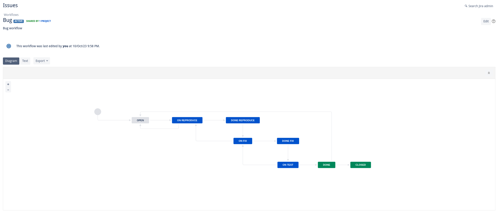  
  
Скриншот `workflow` "Non-Bug":  
  
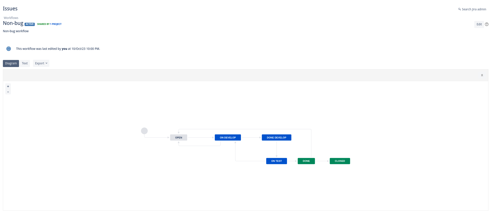
  
## Kanban  
  
В рамках домашнего задания создана общая `Kanban` доска для всех типов задач.  

Столбцы `On reproduce` и `Done reproduce` позволяют перетащить в них только задачи типа `bug`, для остальных типов задач они остаются недоступны:  
  
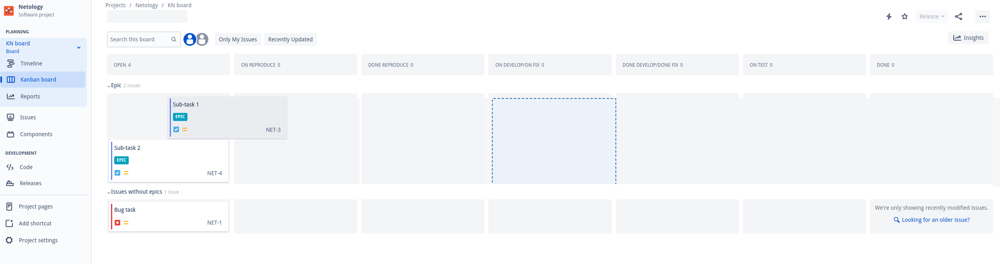

Столбцы `On develop/On fix` и `Done develop/Done fix` допускают отображение задач обоих статусов из двух различных `workflow`. При этом при перетаскивании карточек они будут переводиться в статус, соответствующий типу данной задачи:  
  
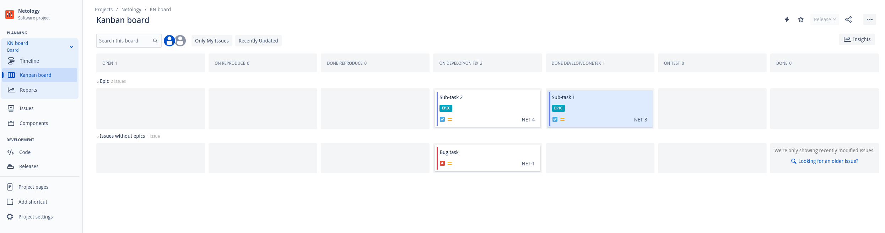

Задачи успешно отработали по всему `workflow` в соответствии со своим типом:  
  
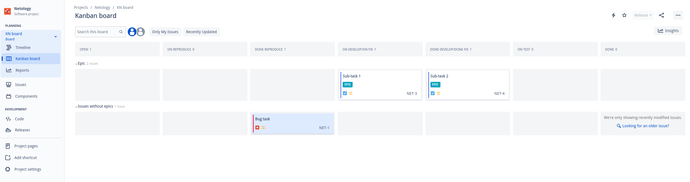  
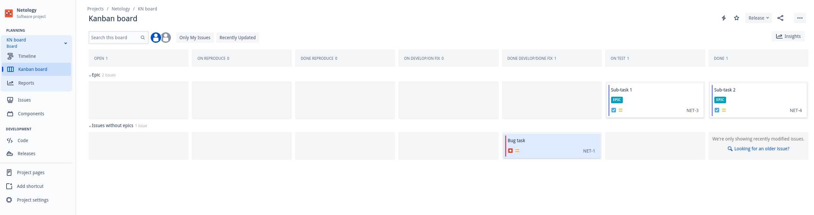  
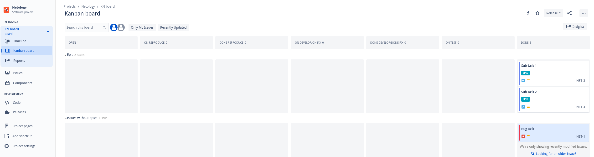  
  
## Scrum  
  
После проверки `workflow` на доске `Kanban` все задачи возвращены в статус `Open`.  Далее был создан новый спринт, задачи доведены до статуса `Closed`, после чего спринт был завершен:  
  
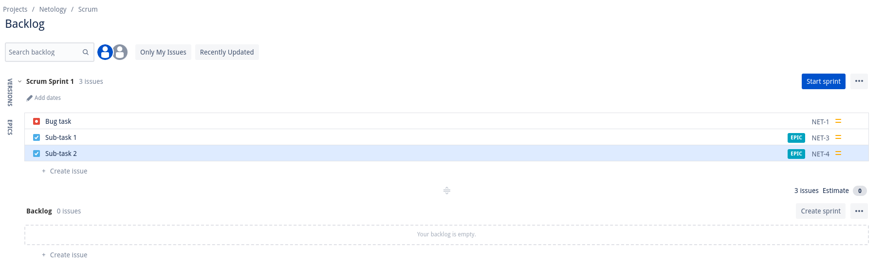 
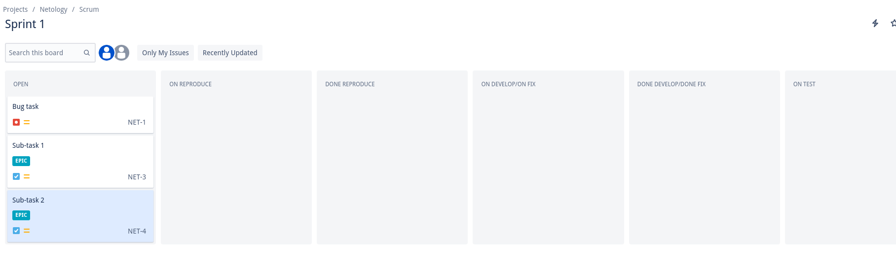 
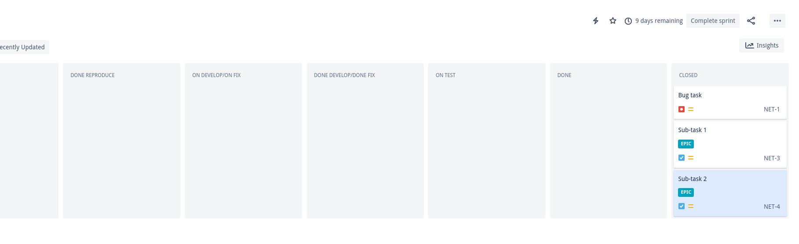 
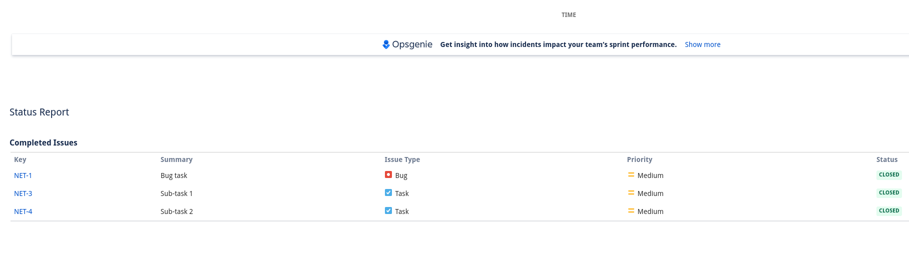 
