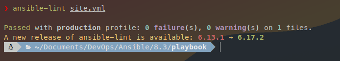
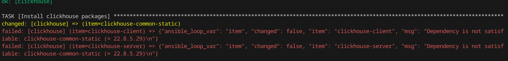
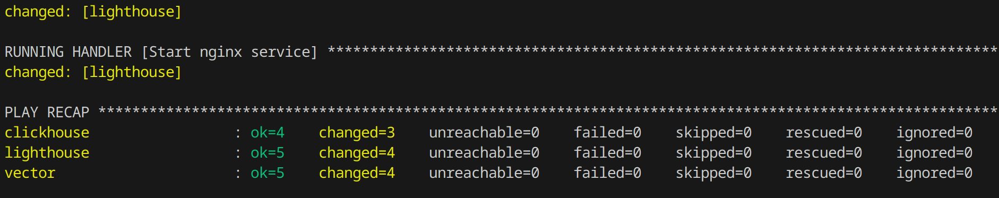
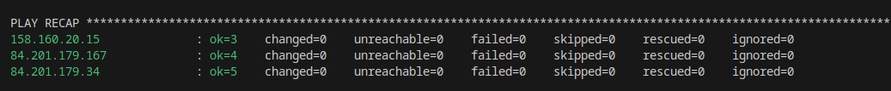

# Домашнее задание к занятию 3 «Использование Ansible»

## Подготовка к выполнению
  
1. Подготовьте в Yandex Cloud три хоста: для `clickhouse`, для `vector` и для `lighthouse`:  
  
    В Yandex Cloud были созданы 3 виртуальные машины с ОС Ubuntu 22.04 с публичными адресами **158.160.20.15** (clickhouse), **84.201.179.34** (vector), **84.201.179.167** (lighthouse). Соответствующие адреса добавлены в файл *inventory/prod.yml* для подключения по ssh. 
  
2. При создании tasks рекомендую использовать модули: `get_url`, `template`, `yum`, `apt`: 
   
    Были использованы следущие модули:  
        - **ansible.builtin.git** для клонирования GIT репозитория  
        - **ansible.builtin.apt** для установки пакета Nginx  
        - **ansible.builtin.copy** для копирования конфигурационного файла Nginx с локальной машины  
        - **ansible.builtin.service** для запуска Nginx   
  
3. Tasks должны: скачать статику LightHouse, установить Nginx или любой другой веб-сервер, настроить его конфиг для открытия LightHouse, запустить веб-сервер: 
   
    Как было описано в предыдущем шаге, LightHouse скачивается с помущью модуля **ansible.builtin.git**, следующим шагом с помощью **ansible.builtin.apt** устанавливаем Nginx и копируем конфиг модулем **ansible.builtin.copy**. Запуск сервера производится с помощью handler, использующий **ansible.builtin.service**.
  
4. Подготовьте свой inventory-файл `prod.yml`: 
   
    Файл создан на шаге 1.

5. Запустите `ansible-lint site.yml` и исправьте ошибки, если они есть:  
  
    
  
6. Попробуйте запустить playbook на этом окружении с флагом `--check`:  
  
      
    Проверка завершается с ошибкой, т.к. отсуствует зависимость, устанавливаемая в данном *play*.  
  
7. Запустите playbook на `prod.yml` окружении с флагом `--diff`. Убедитесь, что изменения на системе произведены:  
  
    
    Не сделал скриншоты к заданиям 6 и 7, пока отрабатывал playbook на ВМ в Яндекс Облаке, поэтому повторил выполнение изменив prod.yml на использование локальных docker контейнеров. При работе с машинами в Яндекс облаке поведение было идентичное.
  
8. Повторно запустите playbook с флагом --diff и убедитесь, что playbook идемпотентен: 
   
      
  
9. Подготовьте README.md файл по своему playbook. В нём должно быть описано: что делает playbook, какие у него есть параметры и теги:  
  
    - 1й play содержит tasks для установки Clickhouse на выделенном хосте.  
        - Task *Install clickhouse packages* в цикле загружает и устанавливает пакеты *clickhouse-common-static*, *clickhouse-client*,*clickhouse-server* (имена пакетов и устанавливаемая версия заданы переменными в файле *group_vars/clickhouse/vars.yml*) в конце task вызывается handler для запуска сервиса.  
        - Следующий task Flush handlers предназначен для исполнения handler не дожидаясь конца текущего play.  
        - В конце текущего play мы создаем новую базу данных **logs** в Clickhouse.  
        - Для всех task в этом play используется тэг **clickhouse**.
    - 2й play отвечает за установку Vector на выделенном хосте.  
        - Task *Upload tar.gz Vector from remote URL* скачивает архив Vector (версия указана в виде переменной в файле *group_vars/clickhouse/vars.yml*)  
        -  Task *Create directrory for Vector* создает новую директорию по пути, указанному в переменной *vector_home* (задана в *group_vars/clickhouse/vars.yml*)  
        - Task *Extract Vector in the installation directory* распаковывает скачанный ранее архив Vector в директорию *vector_home*.  
        - Task *Set environment Vector* исполняет скрипт из шаблона *templates/vec.sh.j2* для экспорта новой директории в PATH.  
        - Для всех task в этом play используется тэг **vector**.  
    - 3й play *Install and configure LightHouse* устанавливает Lighthouse и Nginx на выделенном хосте.  
        - Task *Clone LightHouse GIT repository* клонирует GIT репозиторий Lighthouse в новую директорию */LightHouse*.  
        - Task *Install Nginx* устанавливает на данном хосте Nginx с помощью пакетного менеджера apt.  
        - Task *Copy Nginx config* копирует конфигурационный файл Nginx, предназначенный для открытия Lighthouse. Путь к файлу на локальной машине задан переменной *clickhouse_config* (*group_vars/lighthouse/vars.yml*). В конце task вызывает handler для запуска Nginx.  
        - Для всех task в этом play используется тэг **lighthouse**.  
  
10. Готовый playbook выложите в свой репозиторий, поставьте тег `08-ansible-03-yandex` на фиксирующий коммит, в ответ предоставьте ссылку на него.
