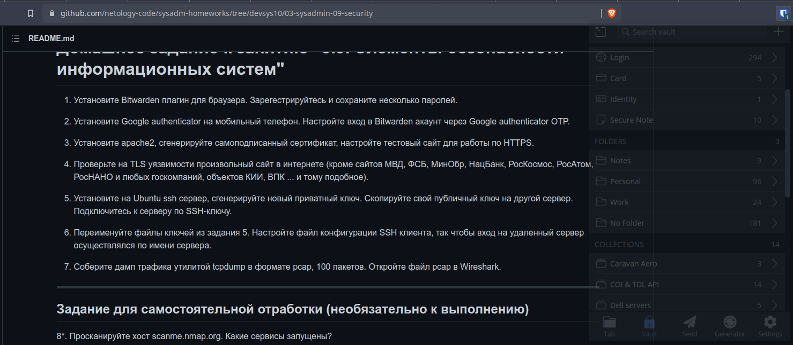
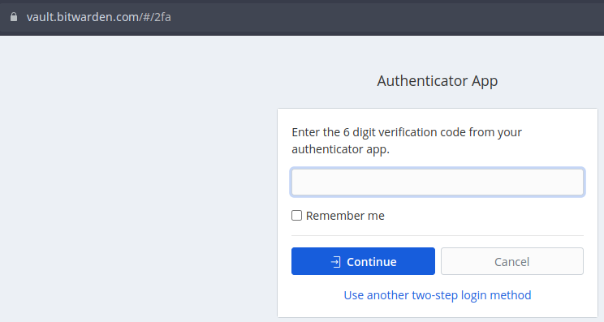
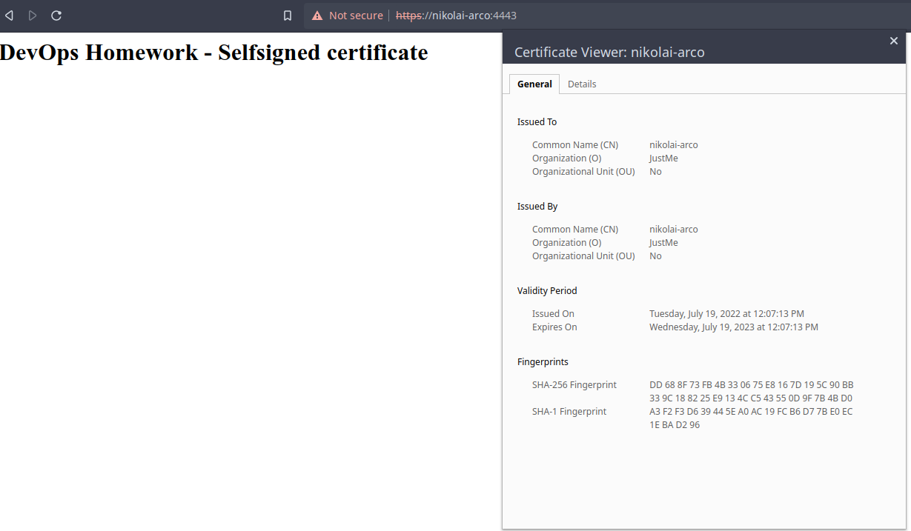
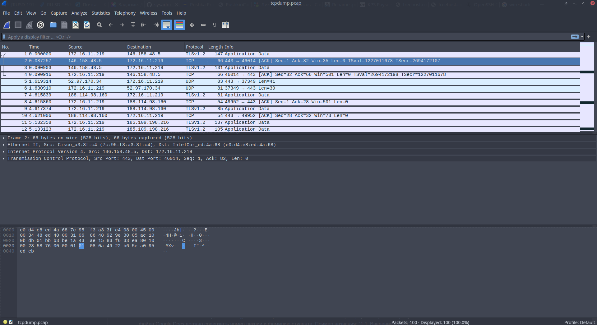

Домашнее задание к занятию "3.9. Элементы безопасности информационных систем"

1. Приятное задание, для которого не пришлось ничего делать, т.к. пользуюсь bitwarden уже много лет :) 
   

2. 2FA также давно используется, только вместо Google Authenticator использую приложение Aegis, т.к. он удобнее в использовании, на главном экране при входе в приложение сразу видно все учетные записи. Скриншоты внутри приложения заблокированы :)
   

3. Создан самоподписанный сертификат и подготовлен тестовый сайт. Браузер, правда, все равно осуждает меня за то, что сертификат самоподписанный :)
   

4. Для testssl установка не требуется, достаточно скопировать git репозиторий  
   ```git clone --depth 1 https://github.com/drwetter/testssl.sh.git```  
   Выполнена проверка на уязвимости ozon.ru  
   `./testssl.sh -U --sneaky https://www.ozon.ru`  
     

5. На хосте установлен ssh сервер, сгенерирована новая пара ключей командой `ssh-keygen`. Виртуальная машина Vagrant по умолчанию настроена с пробросом порта 2222 на 22, подключаться с помощью ssh ключа будем к ней.  
   Копируем ключ `ssh-copy-id -p 2222 vagrant@127.0.0.1`. После чего успешно подключаемся `ssh -p 2222 vagrant@127.0.0.1`  

6. После переименования файлов ключей подключение необходимо осуществлять с флагом `-i new_key_name`.  Либо добавляем следующие строки в конфиг:  
   ```
   Host vagrant
      HostName 127.0.0.1
      User vagrant
      Port 2222
      IdentityFile /home/nikolai/.ssh/vagrant
   ```
   И подключаемся `ssh vagrant`.  

7. Собран дамп следующей командой   
   `sudo tcpdump -w tcpdump.pcap -c 100 -i wlp1s0`  
   После чего записанный файл открыт в wireshark:
     